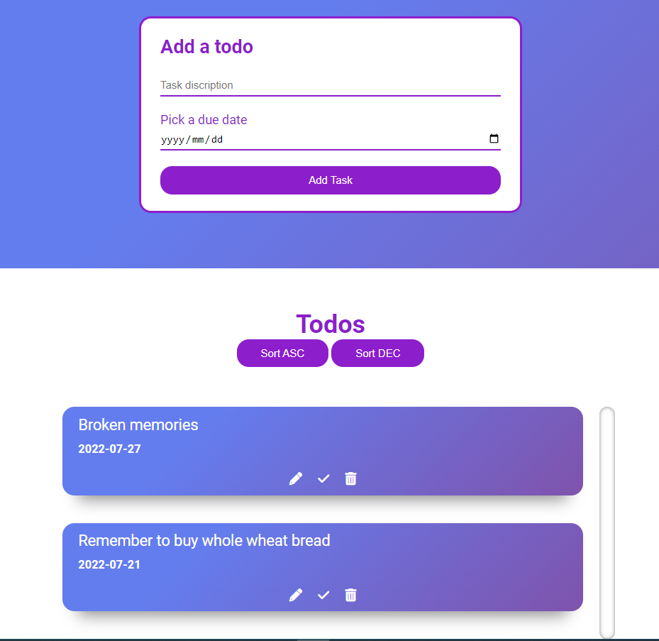
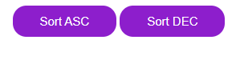
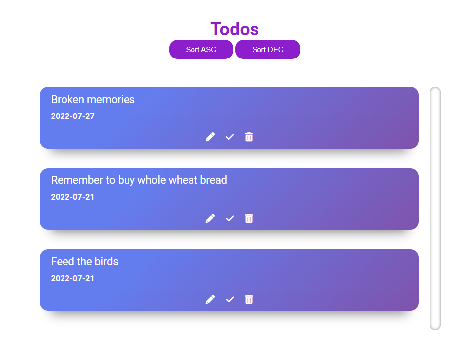
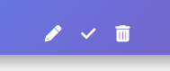
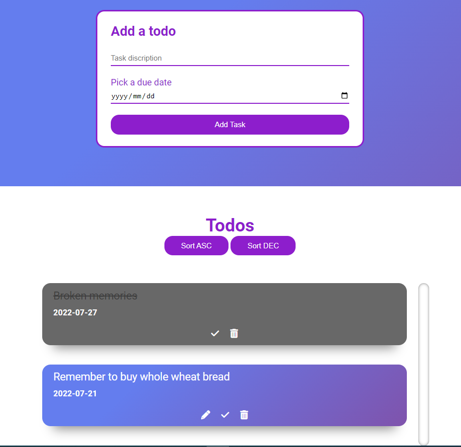

# todoappjs
This is a basic to do app that keeps track of your simple tasks. This app will keep your list persistantly in your browser unless you deletethem or clear your browser data. It's a neat little app to help you in those tight situations. 

## UI (User-Interface)
The UI is simple an easy to use. It consists of task input fields as well  as date input. 
The tasks consist of the task itself and the date as well as the action buttons to sort, edit, mark as complete, or delete the task. 

## Sort Buttons
You can use the sort buttons to sort the task in ascending or decending order. 

## Adding a task
Adding a new task will put it at the bottom of te tasks, you can however use the sort buttons to sort the order. 

## Action Buttons
The action buttons help you change the state of the task, edit or delete it. 

## Completeing a task
When a task is marked as complete you cannot edit it. You can only delete it or you can mark it incomplete again to nbe able to edit it. The task will be crossed out and the container for the task will be grayed out to distingues it form the active tasks. 

